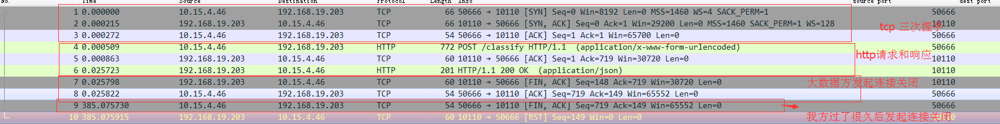
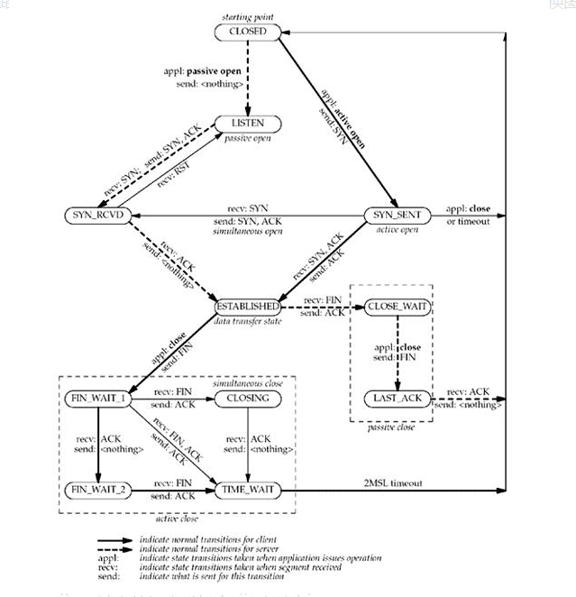

## [TCP连接出现close_wait状态？可能是代码不够健壮](https://www.cnblogs.com/grey-wolf/p/9945637.html)

服务器出现大量close_wait，说说到底是怎么回事？

### 一 问题描述

我们的程序以来了大数据那边的服务，大数据那边提供了restful接口。

测试反应接口有问题，我在本地重现了

我这边感觉抓包可能对分析问题有用，就用wireshark抓包了。然后发给大数据的同时看了下，是他们的问题。

然后就帮忙把问题解决了

然后我这边重更新测试，自己抓包了下，结果反而发现我方程序的一个问题

下图，是我方和大数据放的交互数据包

前三个tcp连接建立，中间（序号4，5，6）为http请求响应，序号7-8为大数据方请求完毕后关闭连接。

好了，看下面的图：（下面这个TCP连接变迁图）

当一个TCP实体（以我方为例），当我方和大数据方建立连接后，一直处于下面的established状态。

收到对方的FIN，我方回应ACK

然后我方进入了close_wait状态。

于是我就去cmd里面查看下，果然存在这个close_wait状态的连接

但是过了没多久，一两分钟，这个状态就自己消失了（猜测是操作系统设置了close_wait超时时间，超时后主动发起fin请求结束了连接）

### 二 关于close_wait

这个状态要怎样才能进入下一个状态（last_ack）呢？

我发给实体只要发起一个FIN即可，这个FIN怎么才能发起呢

那就需要程序主动关闭连接。

我看了下代码，果然是我方HttpUtil发送请求，使用完了没有关闭。

过了一定时间后，我方可能是在close_wait状态持续了一定时间，出发了超时，主动向对方发起了FIN。

但是呢，对方其实已经关闭连接了，所以就返回RST。（对方已经把连接删除了）

我把程序照上面修改之后，重新请求了一次（已经恢复正常，没有出现rst情况了）

### 三 close_wait过多怎么办

结论先说：改代码。

我方程序上线的话，部署在服务器上，close_wait过多，会导致新建立到大数据方的tcp连接失败（因为端口为释放的额原因。）

这个问题，就是本端TCP实体（被动关闭的一端）没有主动关闭连接，大部分都是程序的问题。

要改的话，还是具体看看哪个程序有问题，找到具体的程序后（通过查看有大量close_wait状态的程序的pid），再看程序里和哪个圆度host的连接处于该状态

然后再去程序里找对应的代码，修改即可。

