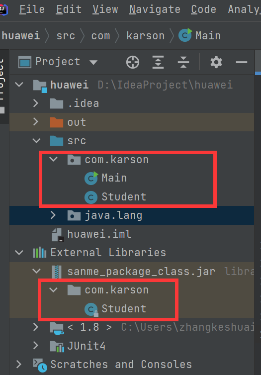
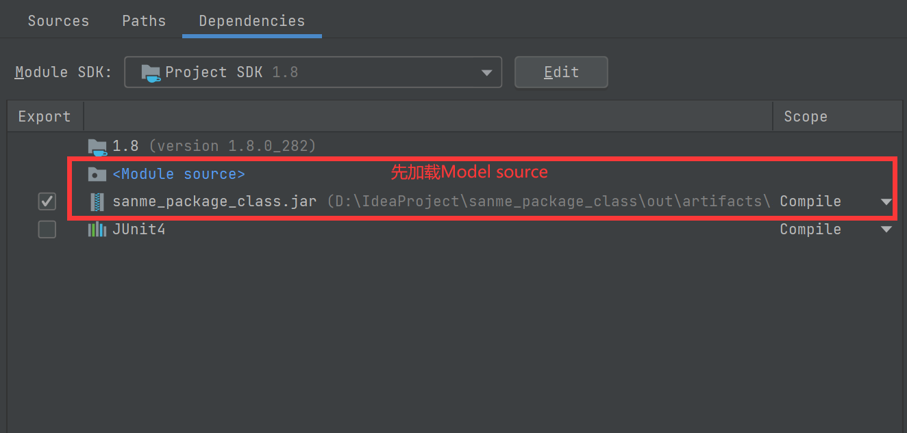
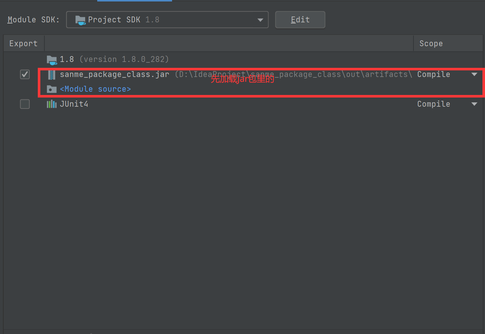

## 同包同名的类，使用哪个，哪个优先

### 一 问题

当自己写的Class和jar包中的类同包同名时，类加载的情况是什么样的？

### 二 思考与猜测

因为类加载时，先判断类是否已经加载，如果没有则加载，如果已经被加载，则不加载。所以，重名的类，先被加载的那个是实际使用的那个。

> 关于，为什么设置成如果加载了就不加载，而不是后加载的去覆盖之前加载的类呢？
>
> 这里以自己项目写的com.karson.Student  和 jar包里的com.karson.Student为例
>
> 其实这个问题不成立，因为Student加载（默认加载顺序先加载自己写的，顺序可调）之后，其Teacher类用到了Student先判断Student是否已经加载，如果已经加载就直接用，Teacher中用到的Student的地方有一个指针指向了Student在方法区的地址；如果Student没有被加载，那么就去加载Student，那么JVM就会按照顺序，也是先判断我们自己写的类里面有没有com.karson.Student这个类，所以最后加载到的还是我们自己写的Student而不是jar包里面的Student；所以，这两种情况，无论是哪一种，都不会加载jar里面的；也就是说JVM根本还不知道jar里面还有一个com.karson.Student；所以我们的字节码文件是有两个Student的问题，但是类加载的时候两个Student只会用到一个，另一个根本就没到类加载的那一步
>
> 还有，如果JVM类加载的时候是扫描全部的字节码文件，然后后扫描到的class去覆盖旧的class，那么这样就会有一个严重的问题：
>
> 比如，com.karson.Teacher使用到了com.karson.Student，然后Teacher方法去中就会有指向Student的指针，那么如果有类加载覆盖的问题，那么Teacher之前指向Student的指针是无效的；也就是说，Teacher类因为Student类被覆盖了，Teacher需要重新被加载。这样会很麻烦。还有，设想一个这样的情形，A类用了B类，B类用了C类，C类用了A类，这样的一个循环使用，类加载的时候可能会死循环。

### 三 证实猜测

确实是先加载自己写的Student

然后整改优先级

用的就是jar包里的

