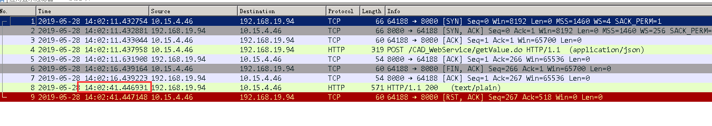

## 服务器出现大量close_wait，原因

### 一 问题：

服务器上有大量的close_wait状态的连接，在服务器上执行netstat命令，如下图：


从上图可以看出，服务器ip是172.18.206.252，端口是443，应该是https服务。

close_wait的危害在于，在一个进程上打开的文件描述符超过一定数量，（在linux上默认是1024，可修改），新来的socket连接就无法建立了，因为每个socket连接也算是一个==文件描述符==。

> 文件描述符，用于表述指向文件的引用的抽象化概念。
>
> 文件描述符在形式上是一个非负整数。实际上，他是一个索引值，指向内核为每一个进程所维护的该进程打开文件的记录表。当程序打开一个现有文件或者创建一个新文件时，内核向进程返回一个文件描述符。在程序设计中，一些设计底层的程序飙血往往会围绕着文件描述符展开。但是文件描述符这一概念往往只适用于Unix系统。
>
> 文件描述符的优点主要有两个：
>
> - 基于文件描述符的IO操作兼容POSIX标准
> - 在Unix、Linux的系统调用中，大量的系统调用都是依赖于文件描述符

linux上，每个进程，都有其自身的资源限制，比如最大可以打开的文件描述符数量。

### 二 问题分析：

我i回想了下，之前也写过一篇close_wait相关的。在那篇文章里，虽然我那也是服务端出现的，但是服务端其实是作为客户端，去调用大数据服务。严格来说，和本文中的场景不一样。

1. 之前博客里的场景：服务端调用大数据，大数据关闭连接（发起fin，服务器返回ack），此时，因为代码不够严谨，没有再次向大数据发送close请求（即在此发送close请求），所以服务端与大数据的连接，在服务端上表现为close_wait。在大数据那边，状态应该是属于FIN_WAIT_2，参考下图：

   

2. 这次遇到的场景：是作为一个小程序的客户端访问了服务器，服务器不知道为啥处于close_wait

   所以，一开始也是没有思路，网上查了下，有人说tomcat的https有bug，更多的直接教你怎么用运维的手段解决。

   后来，有个朋友提到，他们服务器的一个接口，是会去调用微信服务器，生成二维码，而且，他们的监控显示，该方法耗时很长。这时，我想到一个问题：如果服务端在处理过程中耗时较长，（等待锁，下游服务响应慢等），假设20s才返回，但是客户端明显不可能等那么久，一般5-10s就超时了。超时了，客户端发起fin，服务器返回ack，此时服务器应该就是close_wait

   在网上搜索时，发现网上其实有这方面的案例，比如：

   > 我这边的发部分请求都需要查询数据库，我这边的数据库连接池设置的最大连接数是100，所以每一个请求创建一个连接，等到100个请求就把连接池沾满了，但是处理servlet的哪个线程并没有释放这个连接，于是接下来的请求再去创建数据库连接的时候就会一直阻塞在那里，好了，servlet由于得不到数据库连接而阻塞了，这个客户端的请求就一直等待，客户端使用httpclient设置了5s的请求超时时间，那么超时之后，客户端发送FIN关闭连接，服务端TCP返回ACK报文，但是由于处理请求的线程还处于阻塞的状态，所以当前的链接状态是close_wait
   >
   > 警示：
   >
   > 1 代码一定要规范，打开资源之后一定得释放资源
   >
   > 2 数据库连接和访问要设置超时时间，这点避免阻塞很长时间
   >
   > 3 服务器的线程数也需要设置，使得问题尽可能的避免

   我大概估计，就是这个原因

### 三 验证猜测

#### 1 准备工作

我这边的一台服务器是windows的，装了wireshark，方便抓包，上面装了tomcat 8.5，一会直接把war包丢进去跑就好了。

我的打算是，修改目前工程的一个controller接口，让其睡眠30s在返回。客户端的话，用httpclient，写了个测试类，直接调用服务器的controller接口。

然后，用netstat观察该连接的状态变化，同时，wireshark辅助查看网络包的发送情况。

controller代码如下：


客户端代码：

pom.xml加上

```xml
 <dependency>
     <groupId>org.apache.httpcomponents</groupId>
     <artifactId>httpclient</artifactId>
     <version>4.5.3</version>
</dependency>
```

```java
import com.alibaba.fastjson.JSON;
import com.ceiec.base.common.utilities.AppConstants;
import org.apache.commons.io.IOUtils;
import org.apache.commons.lang3.time.StopWatch;
import org.apache.http.HttpEntity;
import org.apache.http.client.ClientProtocolException;
import org.apache.http.client.config.RequestConfig;
import org.apache.http.client.methods.CloseableHttpResponse;
import org.apache.http.client.methods.HttpPost;
import org.apache.http.entity.StringEntity;
import org.apache.http.impl.client.CloseableHttpClient;
import org.apache.http.impl.client.HttpClients;
import org.apache.http.message.BasicHeader;
import org.apache.http.protocol.HTTP;
import org.apache.http.util.EntityUtils;
import org.slf4j.Logger;
import org.slf4j.LoggerFactory;

import java.io.IOException;
import java.util.HashMap;

public final class MyHttpUtils {


    private static int TIMEOUT = 5000;

    private static final String APPLICATION_JSON = "application/json";

    private static final String CONTENT_TYPE_TEXT_JSON = "text/json";

    private static Logger logger = LoggerFactory.getLogger(MyHttpUtils.class);

    /**
     * POST方式提交请求
     * 
     * @param url 请求地址
     * @param json JSON格式请求内容
     * @throws IOException 
     */
    public static String doPost(String url, String json){
        if (json == null) {
            HashMap<String, String> map = new HashMap<>();
            json = JSON.toJSONString(map);
        }
        //计时
        StopWatch timer = new StopWatch();
        timer.start();

        RequestConfig defaultRequestConfig = RequestConfig.custom().setSocketTimeout(TIMEOUT).setConnectTimeout(TIMEOUT).setConnectionRequestTimeout(TIMEOUT).build();
        CloseableHttpClient httpClient = HttpClients.custom().setDefaultRequestConfig(defaultRequestConfig).build();
        HttpPost httpPost = new HttpPost(url);
        httpPost.addHeader(HTTP.CONTENT_TYPE, APPLICATION_JSON);
        StringEntity stringEntity = new StringEntity(json, AppConstants.UTF8);
        stringEntity.setContentType(CONTENT_TYPE_TEXT_JSON);
        stringEntity.setContentEncoding(new BasicHeader(HTTP.CONTENT_TYPE, APPLICATION_JSON));
        httpPost.setEntity(stringEntity);
        httpPost.setConfig(defaultRequestConfig);

        CloseableHttpResponse response = null;
        String responseContent = "";
        try {
            response = httpClient.execute(httpPost);
            int status = response.getStatusLine().getStatusCode();
            logger.debug("response status: " + status);
            if (status >= 200 && status < 300) {
                HttpEntity entity = response.getEntity();
                if (entity == null) {
                    return null;
                }
                responseContent = EntityUtils.toString(entity,"UTF-8");
                return responseContent;
            } else {
                throw new ClientProtocolException("Unexpected response status: " + status);
            }
        } catch (Exception e) {
            logger.error("error occured.{}",e);
            throw new RuntimeException(e);
        } finally {
            timer.stop();
            logger.info("doPost. requestUrl:{}, param:{},response:{},took {} ms", url,json,responseContent,timer.getTime());

            IOUtils.closeQuietly(response);
            IOUtils.closeQuietly(httpClient);
        }
    }


}
```

好了，在正式开始之前，说下MyHttpUtil中标红的那个方法：RequestCOnfig.custom().setSocketTimeout(TIMEOUT)，这个setTimeout表示设置等待服务器响应超时的时间，这里设置为5s

#### 2 测试验证

这里，准备就绪了，启动服务端，然后客户端发起调用，下面是抓的包（服务端视角）


这个包，实在服务器192.168.19.94上抓的。抓的是服务器8080端口，和我本地pc10.15.4.46之间的网络包

分析：

序号1、2、3的包：三次握手

序号4的包：发起http请求，请求的controller方法，会sleep30s

序号5的包：对序号4的包的ack。注意此时的时间是14：2：11

序号6的包：此时时间过去5s，客户端超时，发了个FIN

序号7的包：服务器对FIN的ack

此时服务器还在sleep

此时服务器端TCP连接处于close_wait状态。


25s之后



25s之后，服务器结束sleep，然后给客户端发送响应（序号8），但是，9号包可以看出来，客户端给服务器发送rst


### 四 说到底，问题怎么解决

这种出现close_wait多的情况，是因为服务器端耗时较长，客户端主动断开了连接，此时，服务器端会出现close_wait

那怎么解决呢，看看代码为什么耗时比较长